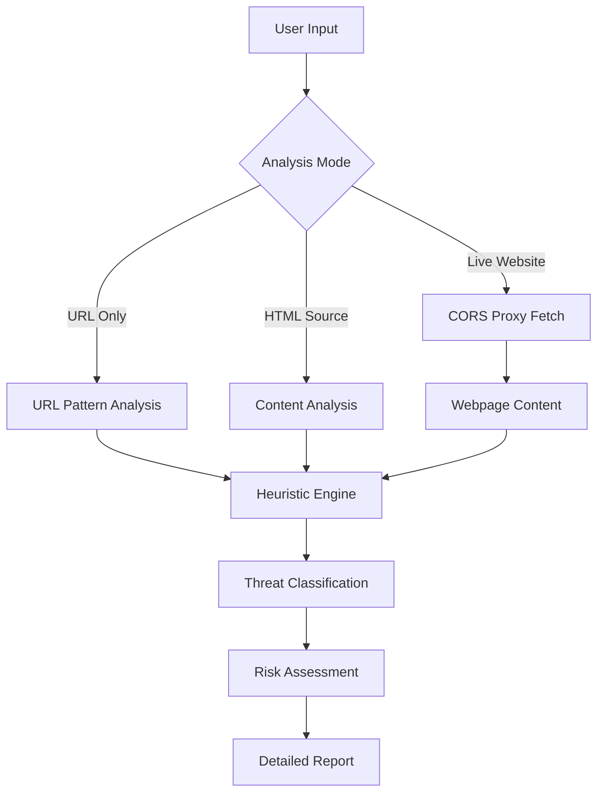

# 🔒 Advanced Phishing Detector

[](https://opensource.org/licenses/MIT)
[](https://nodejs.org/)
[](https://jestjs.io/)
[](https://eslint.org/)
[](https://prettier.io/)

> **Revolutionizing phishing detection through intelligent, multi-layered analysis**

Welcome to **Advanced Phishing Detector** - a cutting-edge cybersecurity tool designed to combat sophisticated phishing attacks. Built for ethical hackers, security researchers, and cybersecurity enthusiasts, this suite provides unparalleled insight into malicious web content.

## 🚀 Quick Start

### Prerequisites
- Node.js 16+ and npm
- Modern web browser

### Installation
```bash
# Clone the repository
git clone https://github.com/amitadhikari8885/Amitrepo.git
cd Amitrepo

# Install dependencies
npm install

# Build the project
npm run build

# Start development server
npm run dev
```

Open `http://localhost:8000` in your browser and navigate to `dist/index.html`.

## 🎯 Core Features

### 🔍 **Multi-Modal Analysis Engine**

| Analysis Mode | Description | Use Case |
|---------------|-------------|----------|
| **URL Analysis** | Lightning-fast URL pattern recognition | Quick security checks |
| **HTML Content Analysis** | Static HTML source code inspection | Code review and analysis |
| **Full Webpage Scan** | Automated live website crawling | Comprehensive threat assessment |

### 🛡️ **Advanced Detection Capabilities**

#### URL Intelligence
- **Protocol Validation**: HTTPS enforcement with SSL verification
- **Domain Analysis**: IP address detection and suspicious keyword identification
- **Structural Assessment**: Subdomain complexity and length analysis
- **Service Recognition**: URL shortener and redirect service detection

#### Content Intelligence
- **Form Analysis**: Credential harvesting form detection
- **Script Security**: Obfuscated JavaScript and malicious code identification
- **Behavioral Patterns**: Urgency language and psychological manipulation detection
- **Branding Verification**: Fake logo and impersonation attempt recognition

#### Network Intelligence
- **Link Analysis**: External hyperlink threat assessment
- **Security Headers**: HTTP/HTTPS usage pattern evaluation
- **CORS Integration**: Cross-origin resource fetching with proxy support

## 📊 Technical Architecture



## 🏆 What Sets Advanced Phishing Detector Apart

### 🔥 **Beyond Basic Checkers**
While most phishing detectors stop at URL validation, Advanced Phishing Detector performs **comprehensive webpage analysis**:

- **Real-time Content Fetching**: Automated webpage retrieval using CORS proxy technology
- **Multi-layered Heuristics**: Combines URL patterns with content-based detection
- **Educational Framework**: Built for CEH certification preparation and cybersecurity learning
- **Zero Dependencies**: Pure client-side implementation for maximum portability

### 🎨 **Professional User Experience**
- **Intuitive Interface**: Clean, professional design with mode-switching capabilities
- **Real-time Feedback**: Live scanning progress and detailed result reporting
- **Responsive Design**: Optimized for desktop and mobile cybersecurity workflows
- **Error Resilience**: Graceful handling of network issues and access restrictions

## 📖 Usage Guide

### Method 1: URL Analysis (Quick Check)
1. Select **"URL Check"** mode
2. Enter suspicious URL: `https://example-bank-login.com`
3. Click **"Analyze URL"**
4. Review instant threat assessment

### Method 2: HTML Content Analysis
1. Choose **"HTML Paste"** mode
2. Copy and paste suspicious webpage HTML source
3. Click **"Analyze HTML"**
4. Study detailed content analysis

### Method 3: Full Webpage Scan (Automated)
1. Choose **"Full Page Scan"** mode
2. Input target URL: `https://suspicious-site.com`
3. Click **"Fetch & Analyze"**
4. Watch real-time analysis progress
5. Study comprehensive threat report

## 🔬 Detection Engine Details

### Heuristic Algorithms

#### URL Pattern Recognition
```javascript
// Example detection logic
if (!url.startsWith('https://')) {
  return { threat: 'INSECURE_PROTOCOL' };
}
if (/^\d+\.\d+\.\d+\.\d+$/.test(hostname)) {
  return { threat: 'IP_BASED_DOMAIN' };
}
```

#### Content Analysis Pipeline
- **Tokenization**: HTML parsing and element extraction
- **Pattern Matching**: Suspicious keyword and structure identification
- **Behavioral Analysis**: Form action and script evaluation
- **Link Validation**: External reference security assessment

### Threat Classification System

| Risk Level | Color Code | Description |
|------------|------------|-------------|
| **Safe** | 🟢 Green | No malicious indicators detected |
| **Warning** | 🟡 Yellow | Potential risks requiring caution |
| **Danger** | 🔴 Red | Strong phishing indicators present |
| **Error** | ⚪ Gray | Analysis could not be completed |

## 🛠️ Project Structure

```
advanced-phishing-detector/
├── src/                          # Source code
│   ├── css/
│   │   └── styles.css           # Application styles
│   ├── js/
│   │   └── detector.js          # Core detection logic
│   └── assets/                  # Static assets
├── tests/                        # Test files
│   └── detector.test.js         # Unit tests
├── scripts/                      # Build scripts
│   └── build.ps1                # Build automation
├── dist/                         # Built application (generated)
├── phishing-detector.html        # Main application
├── index.html                    # Demo login page
├── ceh-plan.yml                  # CEH study roadmap
├── package.json                  # Node.js configuration
├── jest.config.js                # Test configuration
├── eslint.config.js              # Linting configuration
├── .prettierrc                   # Code formatting
├── .gitignore                    # Git ignore rules
├── LICENSE                       # MIT license
├── CONTRIBUTING.md               # Contribution guidelines
└── README.md                     # This documentation
```

## 🧪 Development

### Available Scripts
```bash
npm run build      # Build the project
npm run dev        # Start development server
npm run test       # Run tests
npm run lint       # Check code style
npm run format     # Format code
npm run clean      # Clean build artifacts
```

### Testing
```bash
# Run all tests
npm test

# Run tests in watch mode
npm run test:watch

# Run with coverage
npm test -- --coverage
```

### Code Quality
```bash
# Lint code
npm run lint

# Fix linting issues
npm run lint:fix

# Format code
npm run format

# Check formatting
npm run format:check
```

## 🎓 Educational Value

### CEH Certification Alignment
This project demonstrates key concepts from the **Certified Ethical Hacker** curriculum:

- **Footprinting & Reconnaissance**: Web application analysis techniques
- **Scanning Networks**: Automated content discovery
- **System Hacking**: Vulnerability identification methodologies
- **Social Engineering**: Phishing attack pattern recognition
- **Web Application Security**: Client-side attack prevention

### Learning Objectives
- Understand modern phishing attack vectors
- Implement heuristic-based threat detection
- Master client-side security analysis techniques
- Develop CORS proxy integration skills
- Practice ethical hacking methodologies

## 🤝 Contributing

We welcome contributions from the cybersecurity community! Please see our [Contributing Guide](CONTRIBUTING.md) for details.

### Development Setup
```bash
# Fork and clone the repository
git clone https://github.com/YOUR_USERNAME/Amitrepo.git
cd Amitrepo

# Install dependencies
npm install

# Run tests and linting
npm run test && npm run lint

# Start development
npm run dev
```

## 📄 License

This project is licensed under the **MIT License** - see the [LICENSE](LICENSE) file for details.

## ⚠️ Disclaimer

This tool is designed for **educational and ethical security research purposes only**. Users are responsible for complying with applicable laws and regulations when using this software. The authors assume no liability for misuse or illegal activities.

## 📞 Contact & Support

**Amit Adhikari** - Cybersecurity Enthusiast & CEH Candidate

- **GitHub**: [@amitadhikari8885](https://github.com/amitadhikari8885)
- **Project Repository**: [Amitrepo](https://github.com/amitadhikari8885/Amitrepo)
- **Issues**: [GitHub Issues](https://github.com/amitadhikari8885/Amitrepo/issues)

---

**"Security is not a product, but a process."** - Bruce Schneier

*Built with ❤️ for the cybersecurity community* 🛡️
