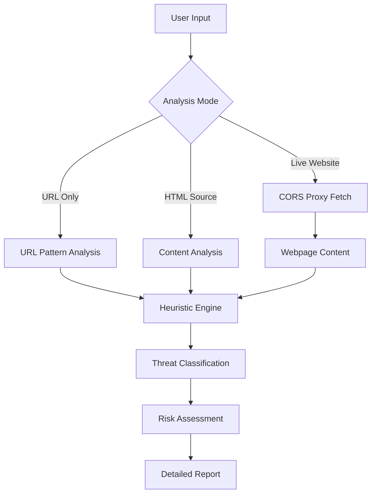

# 🔒 Advanced Phishing Detector

[](https://opensource.org/licenses/MIT)
[](https://en.wikipedia.org/wiki/HTML)
[](https://developer.mozilla.org/en-US/docs/Web/HTML)
[](https://en.wikipedia.org/wiki/Dependency_hell)
[](https://developer.mozilla.org/en-US/docs/Web/Progressive_web_apps/Offline_Service_workers)

> **Revolutionizing phishing detection through intelligent, multi-layered analysis**

Welcome to **Advanced Phishing Detector** - a cutting-edge cybersecurity tool designed to combat sophisticated phishing attacks. Built for ethical hackers, security researchers, and cybersecurity enthusiasts, this suite provides unparalleled insight into malicious web content.

## � Table of Contents

- [🚀 Quick Start](#-quick-start)
- [🎯 Core Features](#-core-features)
- [📊 Technical Architecture](#-technical-architecture)
- [🏆 What Sets Us Apart](#-what-sets-advanced-phishing-detector-apart)
- [📖 Usage Guide](#-usage-guide)
- [🔬 Detection Engine Details](#-detection-engine-details)
- [🛠️ Project Structure](#️-project-structure)
- [🧪 Development](#-development)
- [🎓 Educational Value](#-educational-value)
- [🤝 Contributing](#-contributing)
- [📄 License](#-license)
- [⚠️ Disclaimer](#️-disclaimer)
- [📞 Contact & Support](#-contact--support)

## ✨ Latest Updates

### Version Highlights
- **Standalone Conversion**: Complete migration from full-stack to single-file HTML application
- **Zero Dependencies**: No server setup, databases, or external libraries required
- **Offline Capability**: Works completely offline in any modern web browser
- **Cross-Platform**: Compatible with Windows, macOS, Linux, and mobile devices
- **Simplified Distribution**: Single HTML file can be shared and deployed instantly

## 🚀 Quick Start

### Standalone Version (Recommended)
**No installation required!** Just open the HTML file in your browser:

1. Download `phishing-detector-standalone.html`
2. Open it in any modern web browser (Chrome, Firefox, Safari, Edge)
3. Start scanning URLs and content immediately

**Features:**
- ✅ Works completely offline
- ✅ No server setup needed
- ✅ No dependencies to install
- ✅ All detection logic embedded
- ✅ Cross-platform compatible

### Method 1: URL Analysis (Quick Check)
1. Select **"URL Check"** mode
2. Enter suspicious URL: `https://example-bank-login.com`
3. Click **"Analyze URL"**
4. Review instant threat assessment

### Method 2: HTML Content Analysis
1. Choose **"HTML Paste"** mode
2. Copy and paste suspicious webpage HTML source
3. Click **"Analyze HTML"**
4. Study detailed content analysis

### Method 3: Full Webpage Scan (Automated)
1. Choose **"Full Page Scan"** mode
2. Input target URL: `https://suspicious-site.com`
3. Click **"Fetch & Analyze"**
4. Watch real-time analysis progress
5. Study comprehensive threat report

### Legacy Development Setup
If you want to modify the code or run tests:

```bash
# Install dependencies
npm install

# Run tests
npm test

# Build for distribution
npm run build
```

## 🎯 Core Features

### 🔍 **Multi-Modal Analysis Engine**

| Analysis Mode | Description | Use Case |
|---------------|-------------|----------|
| **URL Analysis** | Lightning-fast URL pattern recognition | Quick security checks |
| **HTML Content Analysis** | Static HTML source code inspection | Code review and analysis |
| **Full Webpage Scan** | Automated live website crawling | Comprehensive threat assessment |

### 🛡️ **Advanced Detection Capabilities**

#### URL Intelligence
- **Protocol Validation**: HTTPS enforcement with SSL verification
- **Domain Analysis**: IP address detection and suspicious keyword identification
- **Structural Assessment**: Subdomain complexity and length analysis
- **Service Recognition**: URL shortener and redirect service detection

#### Content Intelligence
- **Form Analysis**: Credential harvesting form detection
- **Script Security**: Obfuscated JavaScript and malicious code identification
- **Behavioral Patterns**: Urgency language and psychological manipulation detection
- **Branding Verification**: Fake logo and impersonation attempt recognition

#### Network Intelligence
- **Link Analysis**: External hyperlink threat assessment
- **Security Headers**: HTTP/HTTPS usage pattern evaluation
- **CORS Integration**: Cross-origin resource fetching with proxy support

## 📊 Technical Architecture



## 🏆 What Sets Advanced Phishing Detector Apart

### 🔥 **Beyond Basic Checkers**
While most phishing detectors stop at URL validation, Advanced Phishing Detector performs **comprehensive webpage analysis**:

- **Real-time Content Fetching**: Automated webpage retrieval using CORS proxy technology
- **Multi-layered Heuristics**: Combines URL patterns with content-based detection
- **Educational Framework**: Built for CEH certification preparation and cybersecurity learning
- **Zero Dependencies**: Pure client-side implementation for maximum portability

### 🎨 **Professional User Experience**
- **Intuitive Interface**: Clean, professional design with mode-switching capabilities
- **Real-time Feedback**: Live scanning progress and detailed result reporting
- **Responsive Design**: Optimized for desktop and mobile cybersecurity workflows
- **Error Resilience**: Graceful handling of network issues and access restrictions

## 📖 Usage Guide

### Method 1: URL Analysis (Quick Check)
1. Select **"URL Check"** mode
2. Enter suspicious URL: `https://example-bank-login.com`
3. Click **"Analyze URL"**
4. Review instant threat assessment

### Method 2: HTML Content Analysis
1. Choose **"HTML Paste"** mode
2. Copy and paste suspicious webpage HTML source
3. Click **"Analyze HTML"**
4. Study detailed content analysis

### Method 3: Full Webpage Scan (Automated)
1. Choose **"Full Page Scan"** mode
2. Input target URL: `https://suspicious-site.com`
3. Click **"Fetch & Analyze"**
4. Watch real-time analysis progress
5. Study comprehensive threat report

## 🔬 Detection Engine Details

### Heuristic Algorithms

#### URL Pattern Recognition
```javascript
// Example detection logic
if (!url.startsWith('https://')) {
  return { threat: 'INSECURE_PROTOCOL' };
}
if (/^\d+\.\d+\.\d+\.\d+$/.test(hostname)) {
  return { threat: 'IP_BASED_DOMAIN' };
}
```

#### Content Analysis Pipeline
- **Tokenization**: HTML parsing and element extraction
- **Pattern Matching**: Suspicious keyword and structure identification
- **Behavioral Analysis**: Form action and script evaluation
- **Link Validation**: External reference security assessment

### Threat Classification System

| Risk Level | Color Code | Description |
|------------|------------|-------------|
| **Safe** | 🟢 Green | No malicious indicators detected |
| **Warning** | 🟡 Yellow | Potential risks requiring caution |
| **Danger** | 🔴 Red | Strong phishing indicators present |
| **Error** | ⚪ Gray | Analysis could not be completed |

## 🛠️ Project Structure

```
advanced-phishing-detector/
├── phishing-detector-standalone.html  # Complete standalone application
├── ceh-plan.yml                      # Project planning document
├── index.html                        # Simple redirect to standalone version
├── package.json                      # Root package configuration (legacy)
├── README.md                         # This documentation
└── LICENSE                           # MIT license
```

### Standalone Architecture
- **Single File Design**: All HTML, CSS, and JavaScript embedded in one file
- **Zero Dependencies**: No external libraries or frameworks required
- **Browser Native**: Uses modern browser APIs (fetch, URL, DOM)
- **CORS Proxy Integration**: Multiple fallback services for cross-origin requests
- **Responsive UI**: Mobile-friendly interface with professional styling

## 🧪 Development

### Standalone Development
Since this is now a single HTML file, development is straightforward:

1. **Edit the HTML file**: Open `phishing-detector-standalone.html` in any code editor
2. **Modify JavaScript**: Update detection logic in the embedded `<script>` tag
3. **Update CSS**: Modify styles in the embedded `<style>` tag
4. **Test changes**: Open the file in a browser to test modifications

### Development Workflow
```bash
# No setup required - just edit and test
code phishing-detector-standalone.html  # Open in VS Code
# Make your changes
# Open in browser to test
```

### Code Organization
The standalone file contains:
- **HTML Structure**: Complete page layout and UI elements
- **CSS Styling**: Responsive design with professional appearance
- **JavaScript Logic**: All detection algorithms and event handlers
- **Embedded Assets**: No external dependencies or files needed

### Testing the Standalone Version
```bash
# Simply open in browser
start phishing-detector-standalone.html

# Or serve locally if needed
python -m http.server 8000
# Then visit http://localhost:8000/phishing-detector-standalone.html
```

### Customization
- **Add new detection rules**: Modify the `checkUrlSafety()` and `analyzeHtmlContent()` functions
- **Update UI**: Change CSS classes and HTML structure
- **Add features**: Extend JavaScript functionality within the single file
- **Theme changes**: Modify color schemes and styling in the `<style>` section

## 🎓 Educational Value

### CEH Certification Alignment
This project demonstrates key concepts from the **Certified Ethical Hacker** curriculum:

- **Footprinting & Reconnaissance**: Web application analysis techniques
- **Scanning Networks**: Automated content discovery
- **System Hacking**: Vulnerability identification methodologies
- **Social Engineering**: Phishing attack pattern recognition
- **Web Application Security**: Client-side attack prevention

### Learning Objectives
- Understand modern phishing attack vectors
- Implement heuristic-based threat detection
- Master client-side security analysis techniques
- Develop CORS proxy integration skills
- Practice ethical hacking methodologies

## 🤝 Contributing

We welcome contributions from the cybersecurity community! Please see our [Contributing Guide](CONTRIBUTING.md) for details.

### Development Setup
```bash
# Fork and clone the repository
git clone https://github.com/YOUR_USERNAME/Amitrepo.git
cd Amitrepo

# Install dependencies
npm install

# Run tests and linting
npm run test && npm run lint

# Start development
npm run dev
```

## 📄 License

This project is licensed under the **MIT License** - see the [LICENSE](LICENSE) file for details.

## ⚠️ Disclaimer

This tool is designed for **educational and ethical security research purposes only**. Users are responsible for complying with applicable laws and regulations when using this software. The authors assume no liability for misuse or illegal activities.

## 📞 Contact & Support

**Project Information**
- **Author**: Amit Adhikari
- **GitHub**: [@amitadhikari8885](https://github.com/amitadhikari8885)
- **Repository**: [Advanced Phishing Detector](https://github.com/amitadhikari8885/Amitrepo)
- **Issues**: [Report Bugs & Request Features](https://github.com/amitadhikari8885/Amitrepo/issues)
- **Discussions**: [Community Discussions](https://github.com/amitadhikari8885/Amitrepo/discussions)

**Professional Background**
- Cybersecurity Enthusiast & Ethical Hacker
- CEH (Certified Ethical Hacker) Candidate
- Focus: Web Application Security & Threat Detection

---

**"The best defense is a good offense."** - Cybersecurity Proverb

*Built with ❤️ for the cybersecurity community* 🛡️

---

*Last updated: January 26, 2026*
